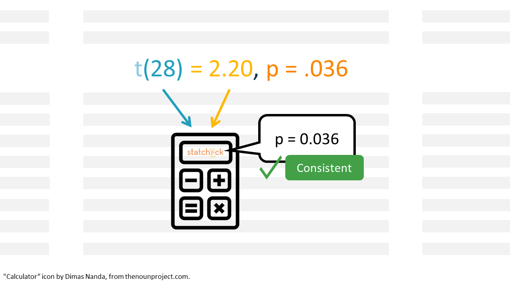

<!-- README.md is generated from README.Rmd. Please edit that file -->
<!-- after editing README.Rmd, run devtools::build_readme() -->

# statcheck 

<!-- badges: start -->

<!-- badges: end -->

## What is statcheck?

`statcheck` is a “spellchecker” for statistics. It checks whether your
*p*-values match their accompanying test statistic and degrees of
freedom.

`statcheck` searches for null-hypothesis significance test (NHST) in APA
style (e.g., *t*(28) = 2.2, *p* \< .05). It recalculates the p-value
using the reported test statistic and degrees of freedom. If the
reported and computed p-values don’t match, `statcheck` will flag the
result as an error.

## What can I use statcheck for?

`statcheck` is mainly useful for:

1.  **Self-checks**: you can use `statcheck` to make sure your
    manuscript doesn’t contain copy-paste errors or other
    inconsistencies before you submit it to a journal.
2.  **Peer review**: editors and reviewers can use `statcheck` to check
    submitted manuscripts for statistical inconsistencies. They can ask
    authors for a correction or clarification before publishing a
    manuscript.
3.  **Research**: `statcheck` can be used to automatically extract
    statistical test results from articles that can then be analyzed.
    You can for instance investigate whether you can predict statistical
    inconsistencies (see e.g., [Nuijten et al.,
    2017](https://www.collabra.org/article/10.1525/collabra.102/)), or
    use it to analyze p-value distributions (see e.g., [Hartgerink et
    al., 2016](https://peerj.com/articles/1935/)).

## How does statcheck work?

The algorithm behind `statcheck` consists of four basic steps:

1.  **Convert** pdf and html articles to plain text files.
2.  **Search** the text for instances of NHST results. Specifically,
    `statcheck` can recognize *t*-tests, *F*-tests, correlations,
    *z*-tests, $\chi^2$ -tests, and Q-tests (from meta-analyses) if they
    are reported completely (test statistic, degrees of freedom, and
    *p*-value) and in APA style.
3.  **Recompute** the *p*-value using the reported test statistic and
    degrees of freedom.
4.  **Compare** the reported and recomputed *p*-value. If the reported
    *p*-value does not match the computed one, the result is marked as
    an *inconsistency* (`Error` in the output). If the reported
    *p*-value is significant and the computed is not, or vice versa, the
    result is marked as a *gross inconsistency* (`DecisionError` in the
    output).

`statcheck` takes into account correct rounding of the test statistic,
and has the option to take into account one-tailed testing. See the
[manual](http://rpubs.com/michelenuijten/statcheckmanual) for details.

## Installation and use

For detailed information about installing and using `statcheck`, see the
[manual on RPubs](http://rpubs.com/michelenuijten/statcheckmanual).

[statcheck.io](http://statcheck.io/) is a web-based interface for
statcheck.
